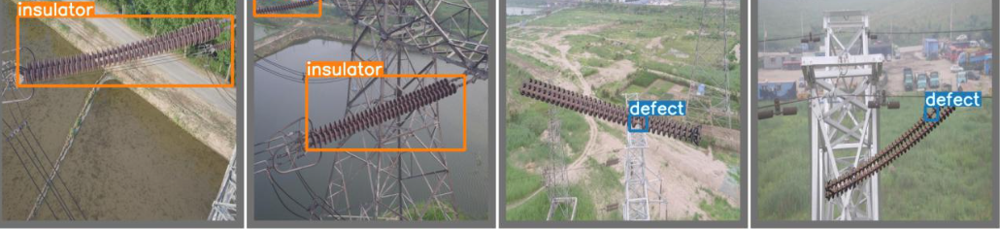

# 🧪 Transmission-Line-fault-detection-yoloV5
****
Trained with YOLO v5 on 1800 high-resolution drone images, our deep learning model achieves an impressive 87.6% mAP for detecting faults and insulators in aerial shots of transmission lines.
*****

## **🌍 Detection_Process**
1. Data Preprocessing
2. Train/Test split
3. Model Training
4. Model validation
5. Model Testing

*****


## 🌐 How to run?
### STEPS:

Clone the repository

```bash
https://github.com/AleemAhmedKhan/Transmission-Line-fault-detection-yoloV5.gitt
```
### 💽  STEP 01- Create a conda environment after opening the repository
    
```bash
conda create -n power python=3.8 -y
```

```bash
conda activate power
```


###  🔍 STEP 02- install the requirements
```bash
pip install -r requirements.txt
```


```bash
# Finally run the following command
python app.py
```
now,
```bash
open up you local host and port
```
```bash
# add your image to the webapp
```


## 📡 CICD-Deployment-with-Github-Actions

## 🛠 Deployment Steps:

1. Build the Docker image of the Source Code
2. Push the Docker image to Container Registry
3. Launch the Web App Server in Azure 
4. Pull the Docker image from the container registry to Web App server and run 
